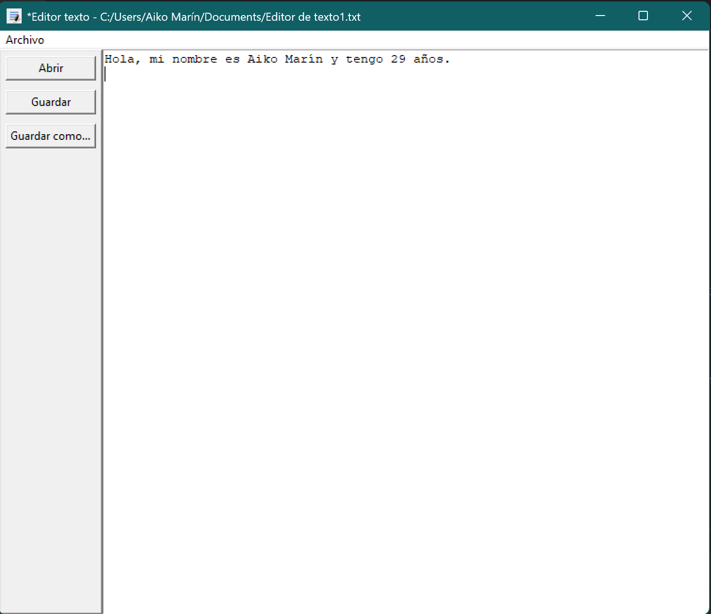

# Editor de Texto en Python

## Descripción

Editor de texto básico desarrollado con Tkinter en Python.

Permite crear, abrir y guardar archivos de texto mediante una interfaz gráfica.

## Funcionalidades

- Abrir archivos .txt
- Editar contenido
- Guardar cambios
- Guardar como nuevo archivo

## Tecnologías

- Python
- Tkinter

## Archivo principal

- editor_texto.py

## Autor

Aiko Marín

## Notas

Proyecto desarrollado como práctica de interfaces gráficas y manejo de archivos en Python.
